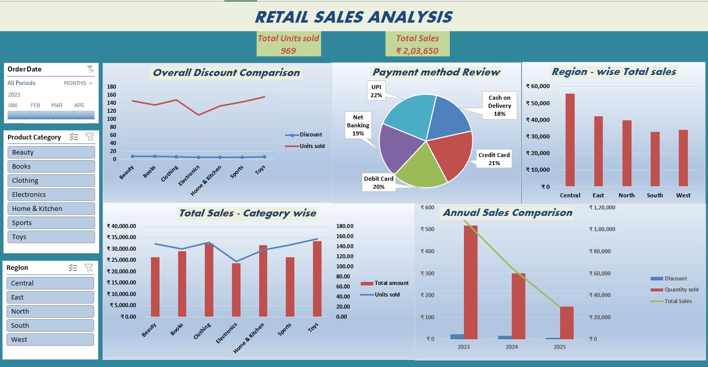

# 📊 Retail Sales Analysis
## ℹ️ Description:
* Retail Sales Analysis project examines sales performance, customer behavior, and regional trends using interactive dashboards.
* It provides insights into product demand, payment preferences, and revenue patterns to support data-driven business decisions.

## 📖 Table of Contents: 
>* Project Overview
>* Database Description
>* Database Schema
>* Tools & Technologies
>* Key Insights
>* Recommendation
>* Conclusion
>* How to Use

## 🔍 Project Overview

* The Retail Sales Analysis project focuses on analyzing sales data to understand customer behavior, product performance, and regional trends.
8 An interactive dashboard is created to visualize key metrics such as total sales, units sold, discounts, and payment methods, enabling data-driven decision-making.

## 🗄️ Database Description

The dataset contains transactional retail data including:

* Order details (Order ID, Order Date)
* Customer information (Customer ID)
* Product details (Category, Product Name)
* Sales metrics (Quantity, Unit Price, Discount, Total Sales)
* Location data (Region)
* Payment information (Payment Method)

## 🛠 Tools & Technologies:

The following tools and technologies were used in this project:

* **Microsoft Excel** – Data cleaning, Pre-processing, Pivot table, Chart, Slicer and visualization

## 🔍 Key Insights

* Total of 969 units sold generating ₹2,03,650 revenue
* Clothing and Toys are top-performing categories
* Central region contributes the highest sales
* UPI is the most preferred payment method
* Discounts are applied consistently without extreme variations
* Sales show a declining trend over the years (2023–2025)

 
 
## 💡Recommendations

* Focus on high-performing categories like Clothing and Toys to maximize revenue.
* Improve sales in low-performing categories (e.g., Electronics) through targeted promotions and pricing strategies.
* Expand business in low-performing regions by increasing marketing and customer outreach.
* Leverage the popularity of UPI payments by offering cashback and digital payment incentives.
* Introduce seasonal and targeted discounts to boost customer engagement and sales.
* Analyze the declining yearly sales trend and implement strategies to improve customer retention.
* Use customer purchase data to develop personalized marketing campaigns.
* Continuously monitor KPIs and update dashboards for real-time decision-making.

## ▶️ How to Use

* Open the dataset in Microsoft Excel.
* Use Pivot Tables and Charts to explore the data.
* Apply filters (Year, Category, Region) using slicers or filter options.
* Analyze trends, KPIs, and patterns to gain meaningful insights.
  
## 👩‍💻 Author
 > Lavanya Madhan Raj
